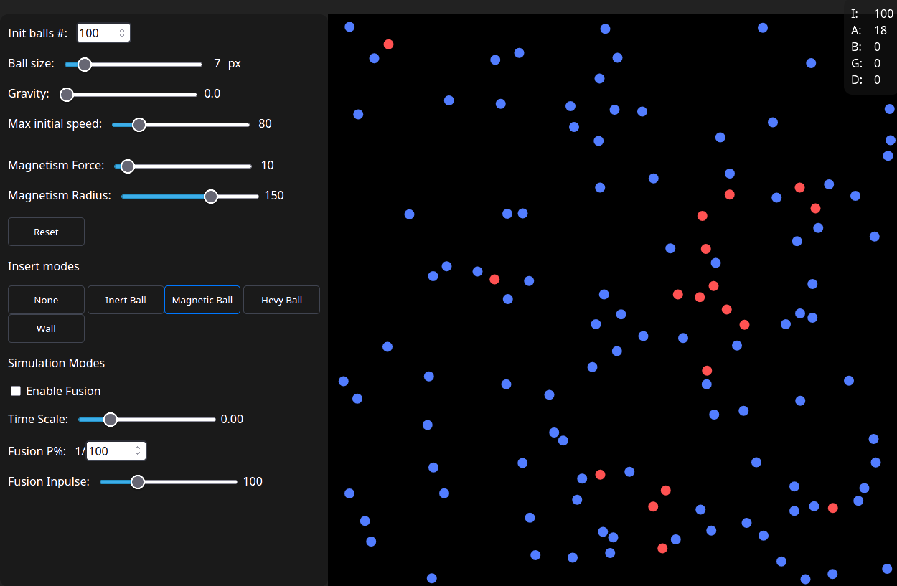

# Elastic Collisions

### Simplified particle simulation model/game

Allows user to experiment with simulates elastic collisions between particles, such as gas atoms



### Use online

See automatically deployed page **[here](https://jvaltteri.github.io/elastic-collisions/)**

### Use offline

1. pull repository
2. start a local server (bring your own server)
3. double click index.html

#### Server options

##### Python server (easiest)
Run this command in the project root
```
python -m http.server 3000
```

##### Go-server (intermediate)
A light server suitable for homelab:

[github.com/JValtteri/go-server](https://github.com/JValtteri/go-server)

##### Pro server (pro)
- nginx
- caddy

